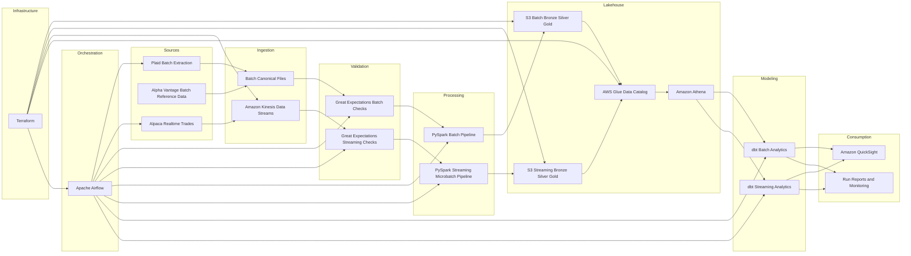

# Financial Data Platform

Production-style financial data platform that supports both nightly batch ingestion and isolated near-real-time streaming analytics on AWS.

This project ingests financial data from external APIs, validates data quality with Great Expectations, processes data with PySpark, publishes curated datasets to Amazon S3, registers metadata in AWS Glue, models analytics in dbt on Athena, orchestrates workflows with Airflow, and prepares dashboard-ready outputs for Amazon QuickSight.

## What This Project Covers

- Batch ingestion with Plaid-style account and transaction extraction
- Realtime streaming ingestion with Alpaca market data and Kinesis
- Bronze, Silver, Gold lakehouse design on Amazon S3
- Glue catalog registration and Athena query layer
- dbt staging, fact, and mart models
- Great Expectations validation for batch and streaming
- Airflow orchestration for batch and streaming DAGs
- Terraform-based AWS infrastructure
- QuickSight handoff assets for analytics dashboards

## Architecture



## High-Level Data Flow

### Batch Pipeline

1. Pull batch data from Plaid sandbox or canonical batch-ready files
2. Validate extracted files with Great Expectations
3. Stage raw files into S3 Bronze
4. Process with PySpark into Silver and Gold datasets
5. Register tables in Glue and query with Athena
6. Build analytics models and tests with dbt
7. Prepare QuickSight-ready reporting marts
8. Orchestrate the entire run with Airflow

### Streaming Pipeline

1. Pull realtime trade events from Alpaca
2. Push events into Amazon Kinesis
3. Consume microbatches into canonical streaming files
4. Validate microbatches with Great Expectations
5. Process with PySpark into isolated streaming Silver and Gold datasets
6. Publish curated streaming outputs to S3
7. Register streaming Glue tables and run Athena smoke checks
8. Build streaming dbt models and tests
9. Prepare streaming QuickSight handoff assets

## Core Technologies

| Layer | Tools |
|---|---|
| Ingestion | Python, Plaid, Alpaca, Alpha Vantage, Kinesis |
| Storage | Amazon S3 |
| Processing | PySpark, local Spark-compatible jobs, Databricks-style structure |
| Validation | Great Expectations |
| Metadata | AWS Glue Data Catalog |
| Query | Amazon Athena |
| Modeling | dbt Core with Athena adapter |
| Orchestration | Apache Airflow with Docker Compose |
| Infrastructure | Terraform |
| Dashboarding | Amazon QuickSight |
| Monitoring | CloudWatch-oriented runbooks and metric payloads |

## Repository Layout

```text
Production_Pipeline/
├── airflow/                 # Batch and streaming DAGs, Airflow image, DAG tests
├── athena/                  # Athena notes and query-layer artifacts
├── config/                  # Environment configs and schema/source mappings
├── data/                    # Local working data and sample references
├── databricks/              # Batch and streaming PySpark pipelines
├── dbt_financial/           # dbt models, tests, seeds, macros, profiles examples
├── docker/                  # Supporting Docker assets
├── great_expectations/      # GX suites, scripts, and GX project files
├── kubernetes/              # Kubernetes documentation/assets
├── monitoring/              # Monitoring docs, CloudWatch refs, runbooks
├── quicksight/              # QuickSight handoff docs and generated manifests
├── reports/                 # Generated run summaries
├── scripts/                 # Local helper scripts
├── src/                     # Python ingestion, publishing, validation, reporting code
├── terraform/               # Modules and environment stacks
├── tests/                   # Unit tests
├── .env.example
├── docker-compose.yml
├── Makefile
└── README.md
```

## Implemented Architecture Decisions

- Batch and streaming paths are isolated so one pipeline does not overwrite the other
- Streaming uses its own S3 bucket, Glue database, and dbt target
- Glue is used as the shared catalog for Athena and QuickSight
- dbt sits on top of Athena rather than replacing PySpark
- Great Expectations validates both extracted files and transformed streaming microbatches
- Airflow orchestrates end-to-end runs but processing stays in dedicated Spark jobs

## AWS Services Used

- Amazon S3
- Amazon Kinesis Data Streams
- AWS Glue Data Catalog
- Amazon Athena
- AWS IAM
- AWS KMS
- Amazon CloudWatch
- Amazon VPC
- Amazon QuickSight

## Local Development Setup

### Prerequisites

- Python 3.11+
- Docker Desktop
- Java 17+ for local Spark execution
- AWS CLI configured locally
- Terraform installed if you want infrastructure provisioning

### Bootstrap

```bash
cd /Users/nikhiljuluri/Desktop/eureka/Production_Pipeline
./scripts/bootstrap.sh
source .venv/bin/activate
```

### Environment File

Copy:

```bash
cp .env.example .env
```

Then fill only the values you need locally.

Do not commit `.env`.

## Main Run Paths

### Start Airflow

```bash
docker compose up -d --build
docker compose ps
```

Airflow UI:

- `http://localhost:8080`

### Run Batch DAG

```bash
docker compose exec airflow-webserver airflow dags trigger financial_batch_workflow
```

### Run Streaming DAG

```bash
docker compose exec airflow-webserver airflow dags trigger financial_streaming_pipeline
```

## Run Components Manually

### Batch Extraction

```bash
.venv/bin/python -m src.sources.plaid_batch.cli \
  --customer-id CUST-NFCU-001 \
  --full-name "Navy Federal Member" \
  --email member@example.com \
  --run-sandbox-seeded-extract \
  --print-record-limit 2
```

### Batch Upload to S3 Bronze

```bash
.venv/bin/python -m src.batch_producer.cli \
  --bucket <batch-bucket> \
  --input-dir data/external_sources/canonical/plaid \
  --latest-only \
  --aws-region us-east-1 \
  --aws-profile default
```

### Local Batch Spark Processing

```bash
bash scripts/run_local_batch_pipeline.sh
```

### Realtime Capture to Kinesis

```bash
.venv/bin/python -m src.sources.alpaca_streaming.cli \
  --symbols "BTC/USD,ETH/USD,SOL/USD" \
  --max-messages 250 \
  --account-id ACCT-NFCU-BROKERAGE-001 \
  --customer-id CUST-NFCU-BROKERAGE-001 \
  --kinesis-stream-name <stream-name> \
  --aws-region us-east-1 \
  --aws-profile default
```

### Consume Streaming Microbatch

```bash
.venv/bin/python -m src.stream_consumer.cli \
  --stream-name <stream-name> \
  --aws-region us-east-1 \
  --aws-profile default
```

### Local Streaming Spark Processing

```bash
bash scripts/run_local_streaming_pipeline.sh
```

## dbt Layer

Batch dbt target:

```bash
docker compose run --rm dbt dbt run \
  --project-dir /workspace/dbt_financial \
  --profiles-dir /workspace/dbt_financial
```

Streaming dbt target:

```bash
docker compose run --rm -e DBT_TARGET=streaming dbt dbt run \
  --project-dir /workspace/dbt_financial \
  --profiles-dir /workspace/dbt_financial \
  --select tag:streaming
```

Streaming dbt tests:

```bash
docker compose run --rm -e DBT_TARGET=streaming dbt dbt test \
  --project-dir /workspace/dbt_financial \
  --profiles-dir /workspace/dbt_financial \
  --select tag:streaming
```

## QuickSight Targets

### Batch

- Database: `fdp_dev_batch_analytics_marts`
- Example marts:
  - `mart_financial_performance`
  - `mart_customer_risk`
  - `mart_regulatory_reconciliation`

### Streaming

- Database: `fdp_dev_streaming_analytics_streaming_marts` in dbt naming terms, depending on schema generation
- Common QuickSight-facing models:
  - `mart_stream_trade_performance`
  - `mart_stream_customer_exposure`
  - `mart_stream_reconciliation`

Note: actual final schema names depend on the dbt target schema plus the folder-level schema naming macro.

## Infrastructure

Terraform environments included:

- `terraform/environments/dev`
- `terraform/environments/s3_only`
- `terraform/environments/streaming_only`
- `terraform/environments/prod`

Use example tfvars files as templates:

```bash
cp terraform/environments/dev/terraform.tfvars.example terraform/environments/dev/terraform.tfvars
```

Then:

```bash
terraform -chdir=terraform/environments/dev init
terraform -chdir=terraform/environments/dev plan -var-file=terraform.tfvars
```

## Validation and Testing

```bash
make lint
make type-check
make test
```

or:

```bash
./scripts/validate.sh
```

## Deployment Readiness Notes

- `.env` must remain local only
- Terraform state files and live `terraform.tfvars` should not be committed
- Generated QuickSight outputs, reports, local data, and GX runtime artifacts should not be committed
- Rotate any API secrets that were exposed during development before public deployment

See:

- [GITHUB_DEPLOYMENT.md](./GITHUB_DEPLOYMENT.md)

## Known Scope Notes

- The codebase is organized in a Databricks-style layout, but local Spark scripts are used when Databricks credentials are not available
- Snowflake artifacts remain in the repository as an optional extension path, but the active analytics path in this implementation is S3 + Glue + Athena + dbt + QuickSight
- Kubernetes assets exist as deployment-oriented artifacts, but local orchestration currently uses Docker Compose and Airflow

## Documentation By Area

- [airflow/README.md](./airflow/README.md)
- [databricks/README.md](./databricks/README.md)
- [dbt_financial/README.md](./dbt_financial/README.md)
- [terraform/README.md](./terraform/README.md)
- [quicksight/README.md](./quicksight/README.md)
- [monitoring/README.md](./monitoring/README.md)

## Outcome

This repository is designed to demonstrate how a modern financial data platform can combine:

- batch ingestion
- realtime streaming
- data quality enforcement
- lakehouse modeling
- cloud-native cataloging and querying
- orchestrated analytics delivery

in one end-to-end architecture that is understandable, testable, and ready to extend.
